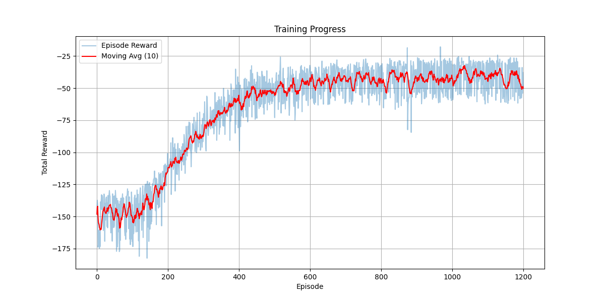
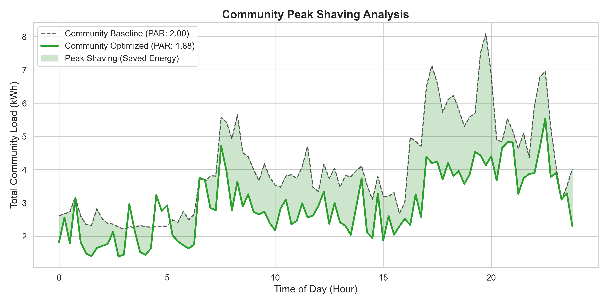
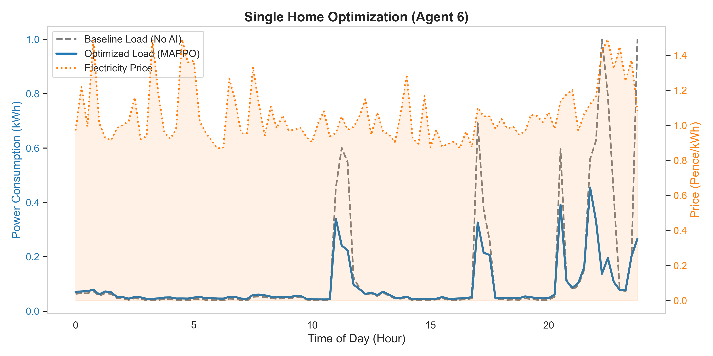
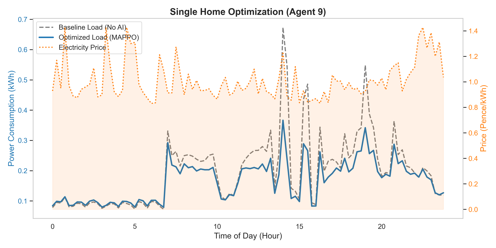

# BI-MARL-DR-UrbanMicrogrids

> Multi-Agent Reinforcement Learning for Continuous Dynamic Pricing and Occupancy-Aware Demand Response in Urban Microgrids

[]()
[]()
[]()
[]()

---

## Overview

This repository contains the implementation of a physically grounded Multi-Agent Reinforcement Learning (MARL) framework for:

- Continuous dynamic pricing
- Occupancy-aware demand response (DR)
- Constraint-aware energy management
- Urban microgrid optimization

The framework models each household as an autonomous reinforcement learning agent that adapts electricity consumption based on:

- Dynamic electricity prices
- Occupancy-derived behavioral flexibility
- Local load states
- Distribution grid constraints

A MAPPO (Multi-Agent Proximal Policy Optimization) architecture with decentralized actors and a centralized critic is used to stabilize cooperative learning under shared network conditions.

The system is evaluated on:

- IEEE 33-bus radial feeder
- IEEE 69-bus radial feeder

while explicitly enforcing:

- Voltage magnitude constraints
- Line thermal constraints

during training.

---

# Paper

**Multi-Agent Reinforcement Learning for Continuous Dynamic Pricing and Occupancy-Aware Demand Response in Urban Microgrids**

### Authors
- Niko Rokni Lamouki
- Parsa Khavarinejad
- Salma Soofiyan
- Amin Karami

---

# Key Features

- Multi-Agent PPO (MAPPO)
- Continuous action-space demand control
- Occupancy-aware behavioral flexibility modeling
- IEEE 33-bus and 69-bus feeder simulations
- Embedded voltage and thermal constraint enforcement
- Centralized training / decentralized execution
- Dynamic pricing environment
- Fairness-aware optimization
- Grid-aware coordinated peak shaving

---

# Repository Structure

```text
BI-MARL-DR-UrbanMicrogrids/

 environments/        # Grid and DR simulation environments
 agents/              # MAPPO actor-critic implementations
 networks/            # Neural network architectures
 training/            # Training loops and PPO updates
 utils/               # Helper functions and metrics
 data/                # Load profiles and pricing signals
 results/             # Saved models and evaluation outputs
 plots/               # Figures and visualizations
 configs/             # Experiment configurations
 README.md
```

---

# Methodology

## Occupancy-Aware Flexibility

Occupancy signal:

$$O_i(t) \in [0,1]$$

Flexibility:

$F_i(t) = 1 - O_i(t)$

Dynamic action bounds:

$a_i(t) \in [-F_i(t), F_i(t)]$

This prevents aggressive load shifting during high-occupancy periods.

---

## Reward Function

The reward jointly optimizes:

- Energy cost
- Peak reduction
- Voltage safety
- Thermal safety
- Occupant comfort

$
r_i^t =
-\lambda_c \pi(t)P_i^{load}(t)
-\lambda_p P_{tot}(t)
-\lambda_V \Delta V_t
-\lambda_S \Delta S_t
-\lambda_d D_i^t
$

---

# Experimental Setup

## Test Feeders

### IEEE 33-Bus
Residential agents mapped to:

```text
{6, 9, 12, 14, 18, 21, 25, 28, 30, 31, 32, 33}
```

### IEEE 69-Bus

```text
{8, 12, 18, 21, 27, 35, 42, 48, 52, 60, 65, 69}
```

---

# Results

## MAPPO Training Convergence

<p align="center">
  
</p>

**Figure:** MAPPO learning convergence across training episodes showing stable policy improvement and reward optimization.

---

## Community Peak Shaving Analysis

<p align="center">
  
</p>

**Figure:** Community-level load profile before and after MARL-based coordinated demand response.

---

## Single Home Optimization Examples

<p align="center">
  
</p>
<p align="center">
  
</p>

**Figure:** Example residential load adaptation under dynamic pricing and occupancy-aware flexibility.

---

## Behavioral Heterogeneity Under Income Sensitivity

results/Experiment_2025-12-30_16-01/inference_images/mappo/high_low_income_comparison.png

**Figure:** Heterogeneous household responses under different economic sensitivity and pricing elasticity conditions.

---

# Performance Summary

| Metric | Baseline | MAPPO | Improvement |
|---|---|---|---|
| Total Cost | 370.54 | 196.15 | **47.06% ↓** |
| Peak Load | 6.37 kW | 4.22 kW | **33.78% ↓** |
| PAR | 1.9531 | 1.9069 | Improved |
| Fairness Index | 1.000 | 0.967 | High fairness retained |

---

# Installation

## Clone Repository

```bash
git clone https://github.com/parsakhavarinejad/BI-MARL-DR-UrbanMicrogrids.git

cd BI-MARL-DR-UrbanMicrogrids
```

## Create Environment

```bash
conda create -n bimarl python=3.10

conda activate bimarl
```

## Install Dependencies

```bash
pip install -r requirements.txt
```

---

# Training and Evaluation

```bash
run_full_experiment.py
```
---

Generated outputs may include:

- Training curves
- Peak shaving analysis
- Cost reduction statistics
- Fairness metrics
- Voltage violation statistics

---

# Citation

```bibtex
@article{lamouki2026marl,
  title={Multi-Agent Reinforcement Learning for Continuous Dynamic Pricing and Occupancy-Aware Demand Response in Urban Microgrids},
  author={Lamouki, Niko Rokni and Khavarinejad, Parsa and Soofiyan, Salma and Karami, Amin},
  year={2026}
}
```

---

# License

This project is released under the MIT License.

---

# Contact

### Parsa Khavarinejad
- GitHub: [@parsakhavarinejad](https://github.com/parsakhavarinejad)
